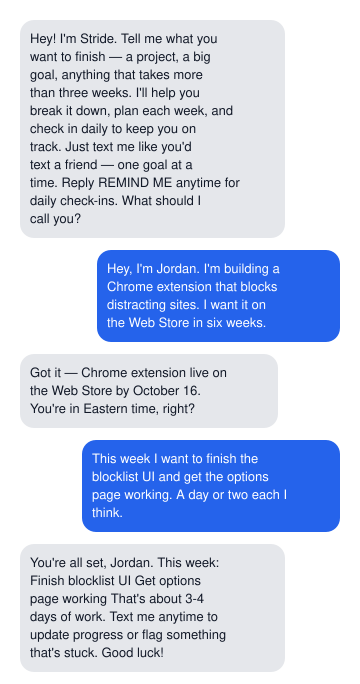
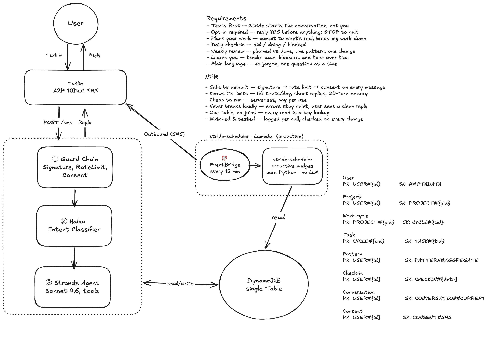
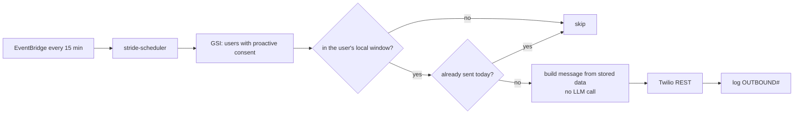
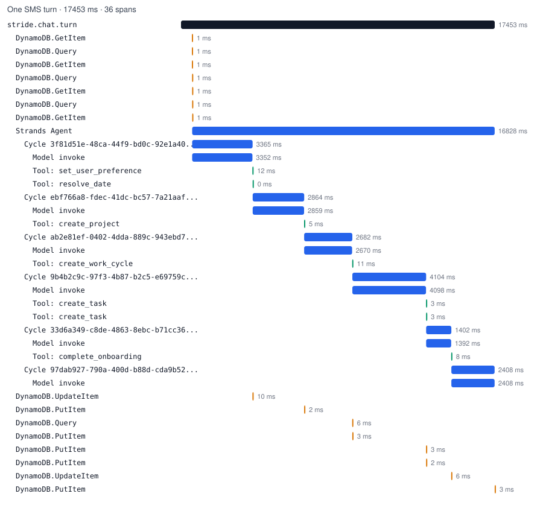

# Stride

[](https://github.com/hamseabd/Stride/actions/workflows/terraform.yml)
[](https://github.com/hamseabd/Stride/actions/workflows/evals-l1.yml)
[](LICENSE)

**An AI productivity coach that lives in your texts.** No app, no login, no dashboard — Stride texts *you*, you text back, and it keeps you honest about what you said you'd finish.

Most productivity tools wait to be opened. Stride pushes first: a daily check-in, a weekly review, a nudge when you've over-committed. The agile machinery underneath (estimates, cycles, velocity, pattern detection) never surfaces — users only ever see plain language.

> Built solo, deployed on AWS, ran a six-user private beta in April 2026 and still runs today.

---

## See it work

<p align="center">
  
</p>

**Turn 1** — opt-in. Intent `conversation`; no tool calls; 1,446 input tokens (8,859 written to cache — this is the first turn) · 89 output; 4,165 ms · **$0.0389**.

**Turn 2** — Jordan describes the project. Intent `conversation`; tool calls `resolve_date`, `set_user_preference`, `create_project`; 5,350 input tokens (26,577 read from cache) · 326 output; 8,660 ms · **$0.0289**.

Full six-turn session: [docs/examples/onboarding-session.md](docs/examples/onboarding-session.md). Generating this transcript before publishing surfaced two real bugs — ids missing from the pre-loaded context and tool calls silently losing tenant binding on a thread pool — both now fixed and both permanent regression tests ([BUG-003 / BUG-004](scrumbot-app/evals/regression/MANIFEST.md)).

Run it yourself: `make chat` needs only an Anthropic key.

---

## Why it's interesting

- **Push, not pull.** A scheduler Lambda decides when to reach out — the proactive message *is* the product. A to-do app doesn't know you; Stride accrues a per-user pattern record (where you overcommit, what you underestimate, what stays blocked) and adapts its tone and timing.
- **Two Lambdas, one table.** Everything runs on `stride-sms` (inbound) and `stride-scheduler` (outbound, every 15 min) over a single DynamoDB table. No relational sprawl, no second datastore.
- **Every inbound SMS clears a guard chain** — Twilio signature → rate limit → consent → intent classifier — before it ever reaches the model. TCPA consent and a 50-msg/day atomic counter are enforced, not aspirational — and every agent turn is bound to the authenticated user server-side, so a prompt-injected text cannot steer tools onto someone else's data ([ADR-0012](docs/adr/0012-server-side-tenant-binding.md)).
- **The agent never improvises its tools.** All 21 tools are declared with the Strands SDK; context is pre-loaded before each turn, history is capped at 20 turns, and every reply is validated (length, jargon, PII) before it's sent.
- **Tested like production, judged like production.** 345 unit tests plus a three-tier eval suite (97 deterministic checks across L1 and regression) — deterministic checks gate every PR; an LLM-as-judge (a *different* model family, to avoid a model grading itself) runs nightly.

---

## How it works

<p align="center">
  
</p>

An inbound message clears the guard chain, gets classified, and — if it's a coaching turn — reaches the agent with everything it needs already loaded:

```mermaid
sequenceDiagram
  participant T as Twilio
  participant H as stride-sms
  participant C as Haiku classifier
  participant A as Sonnet agent (Strands)
  participant D as DynamoDB
  T->>H: POST /sms (signed)
  H->>H: signature · length · rate limit · STOP · consent
  H->>C: classify(message)
  C-->>H: conversation | feedback | remind_me | no_reminders | help
  alt not a coaching turn
    H-->>T: canned reply (TwiML)
  else coaching turn
    H->>D: pre-load projects, tasks, habits, patterns, history
    H->>A: system = cached prefix + user context; bind_user(from)
    A->>D: tool calls (create_task, create_checkin, …)
    A-->>H: reply
    H->>H: validate (length, jargon, empty)
    alt under 12 s
      H-->>T: TwiML reply
    else slow
      H->>T: REST send, empty TwiML
    end
  end
```

The scheduler runs on the same table but never touches the model — it's a timer, a rules check, and a template:



A first-time user is walked through setup; from then on the conversation flows through five session types:

| Session | What happens |
|---|---|
| **Set up** | Tell Stride what you're working on. It creates your projects and plans week one. |
| **Plan your week** | Commit to what's realistic. It challenges overcommitting and breaks big work down. |
| **Daily check-in** | Three fast questions: did / doing / blocked. |
| **Weekly review** | Planned vs. done — honest numbers, one pattern, one change. |
| **Adjust** | Add, drop, or re-estimate mid-week when reality shifts. |

Estimates stay human: **S** (a few hours) · **M** (a day or two) · **L** (most of the week) · **XL** (more than a week — flagged as scope risk).

---

## Stack

| | |
|---|---|
| **Agent** | Strands SDK · Claude Sonnet 4.6 via the Anthropic API |
| **Compute** | AWS Lambda · Python 3.12 · ARM64 (Graviton) · container images |
| **Data** | DynamoDB — single-table design, `PAY_PER_REQUEST` |
| **Messaging** | Twilio A2P 10DLC SMS |
| **IaC** | Terraform + serverless.tf modules · S3/DynamoDB remote state |
| **Observability** | AWS Lambda Powertools v3 — structured telemetry per call (tokens, latency, cost, cache hits) |
| **CI/CD** | GitHub Actions — OIDC auth (no long-lived keys), Docker build → `terraform apply` |

---

## Design decisions

- **Haiku classifies intent before Sonnet ever sees a message** — routing non-coaching turns away drops cost from ~$0.019 to ~$0.0003 per message. [ADR-0003](docs/adr/0003-haiku-classifier-in-front-of-sonnet.md)
- **The handler preloads all context; the agent never fetches its own** — projects, tasks, habits, and patterns are assembled before the model is invoked, so behavior stays predictable and debuggable. [ADR-0004](docs/adr/0004-preload-context-never-let-the-agent-fetch.md)
- **The scheduler never calls an LLM** — proactive nudges are template-rendered Python, so 14,004 runs cost nothing beyond the SMS segment. [ADR-0006](docs/adr/0006-scheduler-never-calls-an-llm.md)
- **The eval judge is a different model family than the agent** — Amazon Nova Pro grades Sonnet's output, avoiding the self-preference bias a same-family judge would carry. [ADR-0007](docs/adr/0007-cross-family-llm-judge.md)
- **The system prompt splits into a cached static prefix and an uncached per-user suffix** — this held cache reuse at 73% of prompt tokens across the beta. [ADR-0008](docs/adr/0008-prompt-layering-for-cache-stability.md)
- **Every agent turn is bound server-side to the authenticated phone number** — a prompt-injected `user_id` in a tool call is checked against the real sender, not trusted. [ADR-0012](docs/adr/0012-server-side-tenant-binding.md)

All thirteen: [docs/adr](docs/adr/README.md).

---

## Production numbers

Six users, one month, no cherry-picking. Small numbers, real ones:

| Metric | Value |
|---|---|
| Beta window | April 2026 — 6 users (owner + friends) |
| Coached turns (Sonnet) | 46 |
| Proactive nudges sent | 31 (morning 14 · evening 9 · planning 5 · midweek 4 · review 4) |
| Scheduler runs | 14,004 — 0 errors, avg 1.0 s |
| Avg agent latency | 2,862 ms (max 20,044 ms) |
| Cache share of prompt tokens | ≈73% |
| Avg cost per coached turn | $0.0191 |
| Total LLM spend, whole beta | $0.90 |

Unit economics, one assumption stated: a user who takes one coached turn per weekday plus the five weekly nudges costs about $0.40 in LLM and $0.30 in SMS per month — under $1, against a $15/mo price.

---

## Observability

Every agent and classifier call emits structured Powertools events — `agent_metrics`, `classifier_metrics`, `scheduler_metrics`, `validation_warning` — as JSON to CloudWatch. AWS X-Ray traces both Lambdas. OpenTelemetry sits alongside X-Ray: each turn opens one root span, Strands' own agent/cycle/model/tool spans nest underneath it, and the whole thing is a no-op unless `OTEL_EXPORTER_OTLP_ENDPOINT` is set — point it at any OTLP backend without a code change.

<p align="center">
  
</p>

<sub>One real turn, captured locally with `chat.py --trace`: four tool calls back to back while planning week one.</sub>

---

## Evals

Quality is enforced in CI, not vibes:

- **L1 — deterministic** (gates every PR, <5s, $0): length, jargon, PII, tool-arg correctness, onboarding order. These delegate to the *same* validator the production path runs, so a check can't pass in CI while drifting in prod.
- **L2 — LLM-as-judge** (nightly): tool selection and coaching tone, scored critique-then-verdict by a cross-family model to avoid self-preference bias.

Today the nightly run is red on purpose. The judge passes; the classifier-recall check does not: the Haiku classifier scores 88% on the `feedback` and `remind_me` intents against a 95% bar (8 fixtures each). It stays red until the classifier prompt is fixed. An eval that names the gap is doing its job.

- **Regression**: every fixed production bug becomes a permanent moto-backed test.

```bash
make eval-l1   # deterministic, no API key needed
make eval-l2   # nightly judge
```

The regression tier holds every production bug as a permanent test — see [MANIFEST](scrumbot-app/evals/regression/MANIFEST.md).

---

## Failure modes considered

Forged webhooks, prompt injection reaching for another user's data, runaway cost from a stuck loop, unsolicited messages under TCPA, a slow model response against Twilio's 15-second deadline — each has a control, and each control has an owner in the code. The full asset list, entry points, and known gaps are in [docs/threat-model.md](docs/threat-model.md).

---

## Run it locally

```bash
cp scrumbot-app/.env.example scrumbot-app/.env   # add ANTHROPIC_API_KEY
make test                                        # unit tests, no key needed
make chat                                        # talk to the agent; DynamoDB mocked in-process
make chat ARGS="--script docs/examples/scripts/onboarding.txt"   # replay the documented session
make up && make chat ARGS="--localstack"         # optional: LocalStack + Flask API, state persists
```

Or open in GitHub Codespaces — the devcontainer installs everything.

The suite includes `tests/test_repo_hygiene.py`, which scans every tracked file for banned words and stray phone numbers; it runs in CI on every push alongside the rest of `tests/`.

## Deploy

```bash
cd scrumbot-infra/bootstrap && terraform init && terraform apply   # one-time: remote state
cp scrumbot-infra/terraform.tfvars.example scrumbot-infra/terraform.tfvars   # add secrets
make deploy                                                        # build → push → terraform apply
```

On push to `main`, CI builds SHA-tagged images and applies Terraform. Secrets (`AWS_ROLE_ARN`, `ANTHROPIC_API_KEY`, Twilio credentials) live in GitHub Actions — never in the repo. Every push to `main` runs unit tests and L1 evals before the image build and `terraform apply`.

---

## Reading guide

- [`functions/sms/handler.py`](scrumbot-app/functions/sms/handler.py) — the guard chain and everything between a webhook and the agent.
- [`shared/tools.py`](scrumbot-app/shared/tools.py) — the 21 tools the agent can call.
- [`shared/tenant.py`](scrumbot-app/shared/tenant.py) — server-side tenant binding.
- [`shared/prompt.py`](scrumbot-app/shared/prompt.py) — the layered system prompt; see [docs/prompt-design.md](docs/prompt-design.md).
- [`shared/telemetry.py`](scrumbot-app/shared/telemetry.py) — the OpenTelemetry wiring, inert by default.
- [`evals/l2/judge.py`](scrumbot-app/evals/l2/judge.py) — the cross-family LLM judge.

---

## What I'd do differently

I'd schedule a security review of tool inputs on day three, not five months in — the tenant-binding gap was a lucky catch, not a designed-in control. I'd also alert on the first eval failure instead of trusting a badge; a nightly suite ran red for 60 runs before anyone noticed. Full list: [docs/retrospective.md](docs/retrospective.md).

---

## Repo layout

```
scrumbot-app/      Python — handlers (sms, scheduler), shared lib, tools, tests, evals
scrumbot-infra/    Terraform — Lambdas, API Gateway, DynamoDB, ECR, IAM, EventBridge
scripts/           build/push images, deploy the marketing site
docs/legal/        privacy policy + terms of service
docs/adr/          13 architecture decision records
docs/examples/     annotated transcript + the script that generates it
.devcontainer/     Codespaces / VS Code container definition
```

The data model is one DynamoDB table; access patterns and the locked schema live in [`scrumbot-app/CLAUDE.md`](scrumbot-app/CLAUDE.md).

---

<sub>Personal project. Code is shared for reference; it targets one specific AWS account and Twilio number and isn't intended as a turnkey deploy.</sub>
